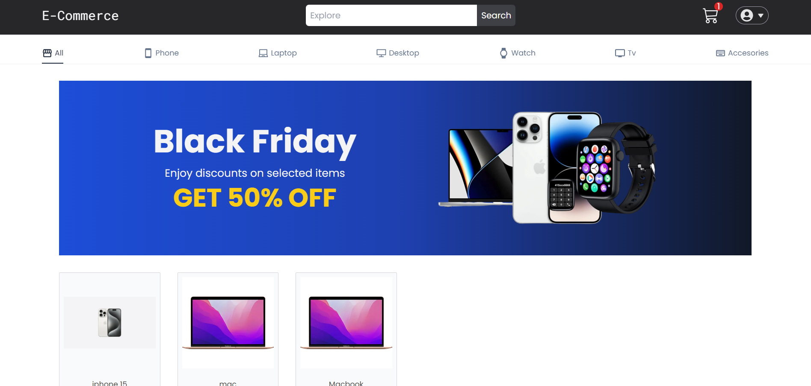
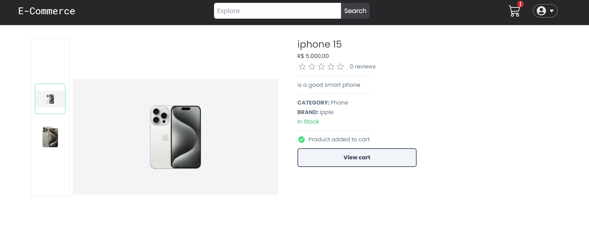
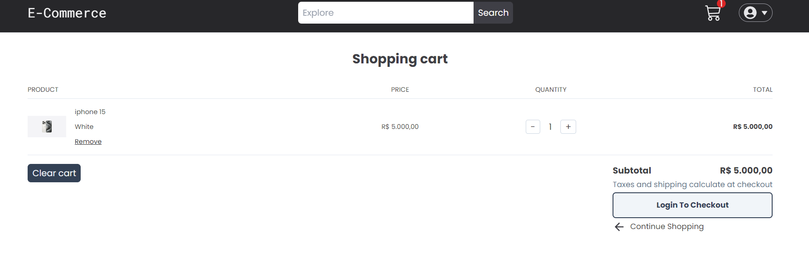
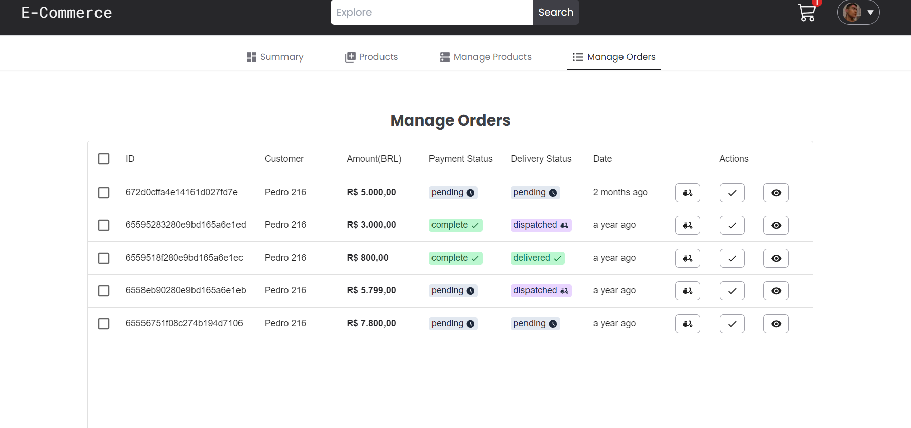

# E-commerce Project

## Overview

This project is a simple e-commerce application built with modern web development tools and technologies. The main goal is to explore and learn new project compositions while implementing key features of an online store.

## Features

- **Product Listing:** Display products with details such as name, price, and images.
- **User Authentication:** Enable user registration and login using Firebase.
- **Cart Management:** Allow users to add products to their cart and proceed to checkout.
- **Payment Integration:** Use Stripe for secure payment processing.
- **Responsive Design:** Ensure the application is mobile-friendly and works seamlessly across devices.

## Tech Stack

### Frontend

- **Next.js:** Framework for React applications, using the App Router for routing.
- **Tailwind CSS:** Utility-first CSS framework for rapid UI development.
- **Material UI:** Component library for pre-designed UI elements.

### Backend

- **Prisma:** ORM for database interaction with MongoDB.
- **MongoDB:** NoSQL database for storing product and user data.

### Additional Services

- **Stripe:** Payment gateway for handling transactions.
- **Firebase:** Authentication service for managing user sign-ins.

## Project Structure

The project follows a modular structure to keep the codebase organized:

```
├── @types/            # Application types
├── actions/           # Next server action
├── app/               # App Router for Next.js
├── app/api            # For internal api requests
├── app/components/    # Reusable UI components
├── hooks/
├── libs/              # Connection with sternal resources
├── prisma/            # Database schema and Prisma client
├── pages/             # Fallback pages to auth and payment
├── providers/         # Cart provider
└── utils/             # Helper functions and configurations
```

## Some Screenshots

### Home Page



### Product Page



### Cart Page



### Admin Page



## Getting Started

### Installation

1. Clone the repository:
   ```bash
   git clone https://github.com/your-username/ecommerce-project.git
   cd ecommerce-project
   ```
2. Install dependencies:
   ```bash
   npm install
   ```
3. Configure environment variables:
   Create a `.env` file in the root directory and add the following:
   ```env
   DATABASE_URL=
   NEXTAUTH_SECRET=
   GOOGLE_CLIENT_ID=
   GOOGLE_CLIENT_SECRET=
   STRIPE_SECRET_KEY=
   NEXT_PUBLIC_STRIPE_PUBLISHABLE_KEY=
   STRIPE_WEBHOOK_SECRET=
   NEXT_PUBLIC_FIREBASE_API_KEY=
   ```
4. Run the Prisma migrations:
   ```bash
   npx prisma migrate dev
   ```
5. Start the development server:
   ```bash
   npm run dev
   ```
